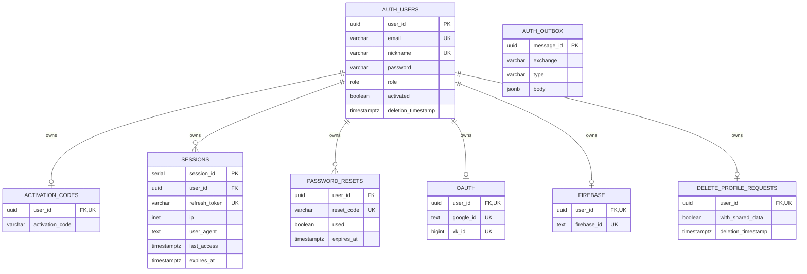

# ChefBook Backend Auth Service

The auth service owns identity, credentials, sessions, OAuth bindings, JWT issuing, account activation, password recovery, profile deletion state, and auth-related outgoing events.

## Responsibilities

- Account sign-up, activation, sign-in, refresh, and sign-out.
- RSA-signed JWT access token issuing.
- Refresh session storage and session termination.
- Google and VK OAuth connection and sign-in.
- Password reset and password change flows.
- Nickname availability and assignment.
- Profile deletion request state.
- Auth information lookup for other services.
- Public key exposure for gateway JWT validation.

## Main RPC Families

- `SignUp`, `ActivateProfile`, `SignIn`, `RefreshSession`, `SignOut`
- `RequestGoogleOAuth`, `SignInGoogle`, `ConnectGoogle`, `DeleteGoogleConnection`
- `RequestVkOAuth`, `SignInVk`, `ConnectVk`, `DeleteVkConnection`
- `GetSessions`, `EndSessions`
- `RequestPasswordReset`, `ResetPassword`, `ChangePassword`
- `GetProfileDeletionStatus`, `DeleteProfile`, `CancelProfileDeletion`
- `GetAccessTokenPublicKey`, `GetAuthInfo`, `GetVisibleNames`, `CheckNicknameAvailability`, `SetNickname`

## Dependencies

- Calls `subscription` for subscription-related auth behavior.
- Publishes auth/profile lifecycle messages through MQ when configured.
- Owns its PostgreSQL schema and migrations.

## Database Ownership

Owns:

- `users` - credentials, activation state, role, nickname, deletion timestamp.
- `activation_codes` - one active activation code per user.
- `sessions` - refresh token sessions.
- `password_resets` - password reset codes.
- `oauth` - Google and VK bindings.
- `firebase` - Firebase identity bindings.
- `delete_profile_requests` - pending profile deletion workflow.
- `outbox` - outgoing MQ events.

Important constraints:

- `users.email` and `users.nickname` are unique.
- `activation_codes`, `oauth`, `firebase`, and `delete_profile_requests` are one-to-one with `users`.
- `password_resets.reset_code` and `sessions.refresh_token` are globally unique.
